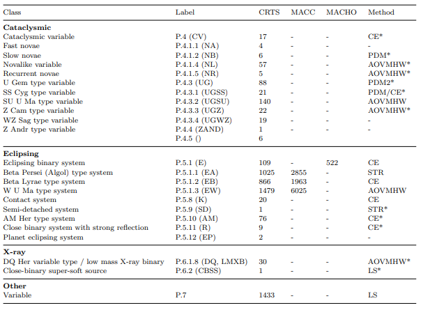

### Overview of period finding algorithms: 

[A comparison of period finding algorithms (Graham et al. 2011)](https://academic.oup.com/mnras/article/434/4/3423/963890)

Implementations of some popular algorithms:
- Lomb-Scargle Periodogram ([astropy implementation](https://docs.astropy.org/en/stable/timeseries/lombscargle.html))
- Box Least Squares ([astropy implementation](https://docs.astropy.org/en/stable/timeseries/bls.html))
- add others here...

**Problem**: although many algorithms for period finding exist, no one algorithm works uniformly well for all types of periodic variables! Some algorithms favor multiples or fractions of the true period, or do not pick out the dominant period component.

Table from Graham 2011:

**Project goal**: can we use supervised machine learning (trained on sources with known periods) to combine multiple period-finding methods to consistently select the correct period?

### A proposed solution to automated period-finding using supervised machine learning classification:

**Supervised learning** requires two steps:
1. **Training step**: given an *n*-dimensional **feature vector** for *N* training sources with known periods (represented by a **label vector**), the parameters of a machine learning classifier are optimized to output the training labels. 

$$
\underbrace{
    \begin{bmatrix}
    f_{11} \\ f_{12} \\  \vdots \\ f_{1n}
    \end{bmatrix}, 
    \begin{bmatrix}
    f_{21} \\ f_{22} \\  \vdots \\ f_{2n}
    \end{bmatrix},
    \dots ,
    \begin{bmatrix}
    f_{N1} \\ f_{N2} \\  \vdots \\ f_{Nn}
    \end{bmatrix}
}_{Input: \, Training \, feature \, vectors}
\qquad \Rightarrow \qquad
\fbox{ML Classifier}
\qquad \Rightarrow \qquad
\underbrace{
    \begin{bmatrix}
    1 \\ 0 \\ \vdots \\ 0
    \end{bmatrix}, 
    \begin{bmatrix}
    0 \\ 0 \\  \vdots \\ 1
    \end{bmatrix},
    \dots ,
    \begin{bmatrix}
    0 \\ 1 \\  \vdots \\ 1
    \end{bmatrix}
}_{Output: \, Training \, label \, vectors}
$$

2. **Test step**: the paramters of the classifier learned in step (1) are held fixed, and the label vector is computed for a feature vector of a new source, unseen before by the classifier.

$$
\underbrace{
    \begin{bmatrix}
    f_{11} \\ f_{12} \\  \vdots \\ f_{1n}
    \end{bmatrix}
}_{Input: \, New \, feature \, vector}
\qquad \Rightarrow \qquad
\fbox{ML Classifier}
\qquad \Rightarrow \qquad
\underbrace{
    \begin{bmatrix}
    1 \\ 0 \\ \vdots \\ 0
    \end{bmatrix}, 
}_{Output: \, Test \, label \, vector}
$$

### Defining the label vector:

An example of how we could define classes might be:

$$ [P_{LS}^{(1)}, P_{LS}^{(2)}, \dots, P_{BLS}^{(1)}, P_{BLS}^{(2)}, \dots, P_{ACF}^{(1)}, P_{ACF}^{(2)}, \dots] $$

where 
- $P_{LS}^{(i)}$ would represent the ith harmonic of the Lomb-Scargle (LS) periodogram
- $P_{BLS}^{(i)}$ would represent the ith harmonic of the Box Least Squares (BLS) periodogram
- $P_{ACF}^{(i)}$ would represent the ith peak in the auto-correlation function
- etc. for other methods

and the label vector associated with a source would be represented by a vector of 1s and 0s, which correspond to which classes give the correct period (within some error). For example, using the convention defined above the vector
$$ [1,0,\dots,0,1,\dots,0,0] $$
the first highest LS peak and the second highest BLS peak give the correct period, and ACF does not find the correct period.
A vector of all zeros would represent a source that is either non-periodic, or one which none of the methods (e.g. LS, BLS, ACF) used all estimate the wrong period.

### Defining the ML Classifier:

I think this is a [multi-label classification](https://en.wikipedia.org/wiki/Multi-label_classification) problem. scikit-learn might be the place to start hacking:

- https://scikit-learn.org/stable/modules/multiclass.html#multilabel-classification-format

### Defining the feature vector:

Examples of features we might want to extract could be:
- the period values
- periodogram peak heights and widths ([scipy.signal peak finding](https://docs.scipy.org/doc/scipy/reference/generated/scipy.signal.find_peaks.html))
- periodogram peak significance and false alarm probability ([astropy implementation](https://docs.astropy.org/en/stable/timeseries/lombscargle.html#peak-significance-and-false-alarm-probabilities))
- auto-correlation function peak heights
- light curve statistics?
- $\chi^2$ of phase-folded light curve
- others...

Potentially useful libraries:
- [cesium](http://cesium-ml.org/)
- [tsfresh](https://tsfresh.readthedocs.io/en/latest/index.html)
- [feets](https://feets.readthedocs.io/en/latest/)
- others?